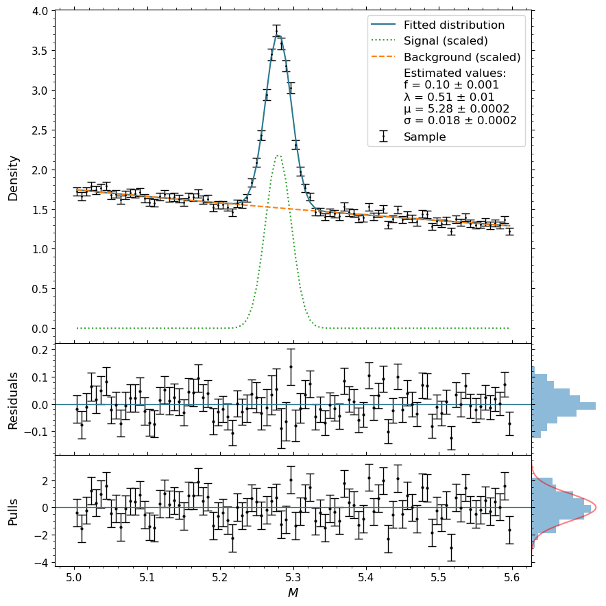

# Signal-Search

This repository contains python scripts for conducting a high statistics simulated power analysis for two hypothetical signal searches, described below:

### Experiment 1:
$H_0$: $P(X) = \text{Exp}(\lambda)$

$H_1$: $P(X) = f \cdot \cal{N}(\mu, \sigma) + (1-f) \cdot \text{Exp}(\lambda)$

### Experiment 2:
$H_0$: $P(X) = f \cdot \cal{N}(\mu, \sigma) + (1-f) \cdot \text{Exp}(\lambda)$

$H_1$: $P(X) = f_1 \cdot \cal{N}(\mu_1, \sigma_1) + f_2 \cdot \cal{N}(\mu_2, \sigma_2) + (1-f1-f_2) \cdot \text{Exp}(\lambda)$

More details can be found in the distributions module.

